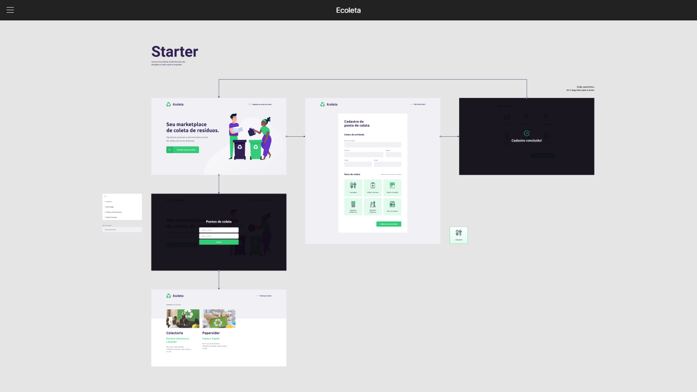

# [Ecoleta - Next Level Week #1](https://skylab.rocketseat.com.br) [](https://rocketseat.com.br)

<div>
  
  <a href="https://jszvitor.github.io">
    
  </a>
  <a href="https://github.com/jszvitor">
    
  </a>
</div>

<h1 align="center">
  
</h1>


## [Prototype of this project](https://www.figma.com/file/1SxgOMojOB2zYT0Mdk28lB/Ecoleta)
<h1 align="center">
  
</h1>

## File Structure
Within the download you'll find the following directories and files:

```
Ecoleta/
├── public
│   ├── assets
│   │   ├── icons
│   │   │   ├── arrow-left.svg
│   │   │   ├── baterias.svg
│   │   │   ├── check.svg
│   │   │   ├── eletronicos.svg
│   │   │   ├── home-background.svg
│   │   │   ├── lampadas.svg
│   │   │   ├── log-in.svg
│   │   │   ├── logo.svg
│   │   │   ├── oleo.svg
│   │   │   ├── organicos.svg
│   │   │   ├── papeis-papelao.svg
│   │   │   ├── search.svg
│   │   │   └── x.svg
│   │   └── styles
│   │       ├── create-point.css
│   │       ├── home.css
│   │       ├── main.css
│   │       ├── modal.css
│   │       ├── responsive.css
│   │       └── search-results.css
│   └── scripts
│       ├── create-point.js
│       ├── index.js
│       └── intro.js
├── readmeAssets
│   └── Home.png
├── src
│   ├── database
│   │   ├── database.db
│   │   └── db.js
│   ├── views
│   │   ├── partials
│   │   │   ├── motal.html
│   │   │   ├── page-header.html
│   │   │   └── point-created.html
│   │   ├── create-point.html
│   │   ├── index.html
│   │   ├── layout.html
│   │   └── search-results.html
│   └── server.js
├── .gitignore
├── package-lock.json
├── package.json
└── README.md
```
